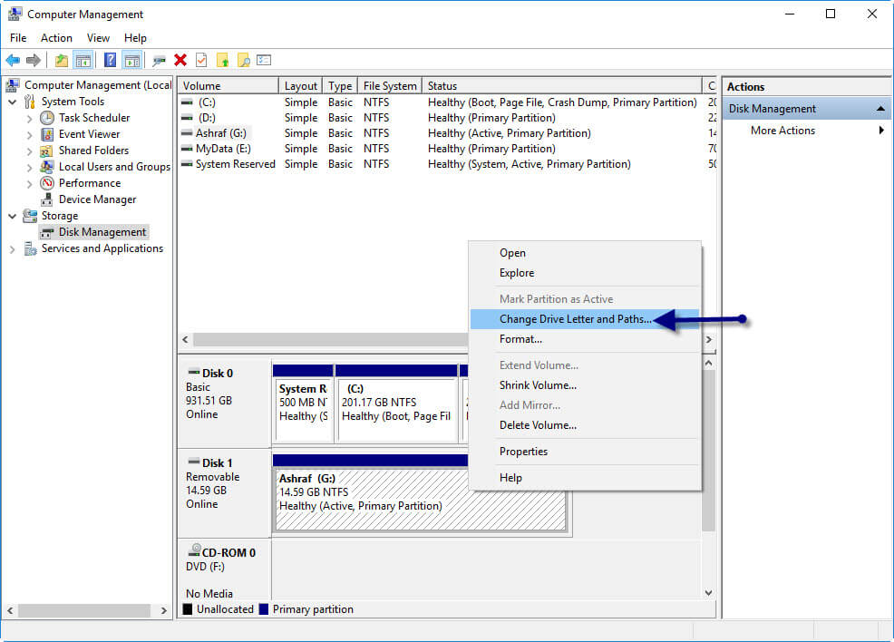
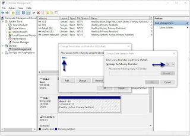

# Repair corrupted USB flash drive without formatting

First step of our USB flash drive repair tutorial is fixing the flash disk without formatting because may be it have important files so you need to save them athere is many reasons that can make USB pen drive data to be inaccessible as example USB flash drive not working, not detecting, format error message appears every time you connect the lash drive.

## 1 - Changing The USB flash disk Letter from Disk Management

We can use this way before we do anything, maybe it is unable to assign drive letters (like C, D, E) to the flash drive. For that reason, we can't access the data inside our pen drive. To fix this issue, please follow the instructions below

- Plug in USB pen drive to your Laptop or Computer.
- Right Click on Computer then Choose Manage .
- Click on Disk Management ,you will see all storage device connected
- Right Click on your USB flash drive then choose "Change Drive Letters and Paths ..."

- Click on Change then Choose another Letter to assign to your flash disk .
- Click 0K.

- Remove your flash disk then plug in again.
- Try to open it now. if this way not worked please use the next method.
